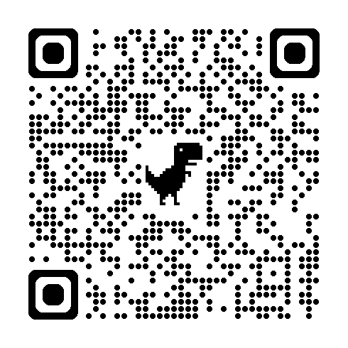
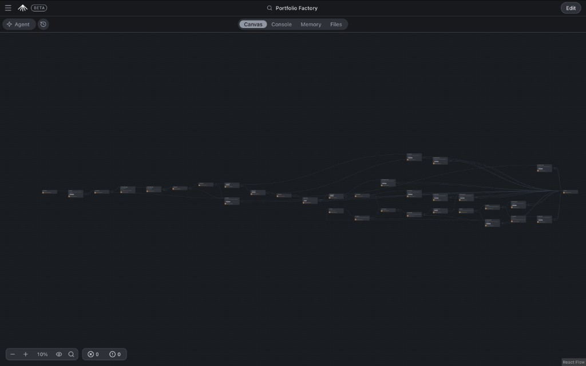
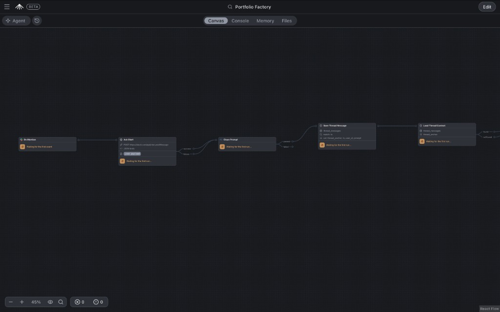
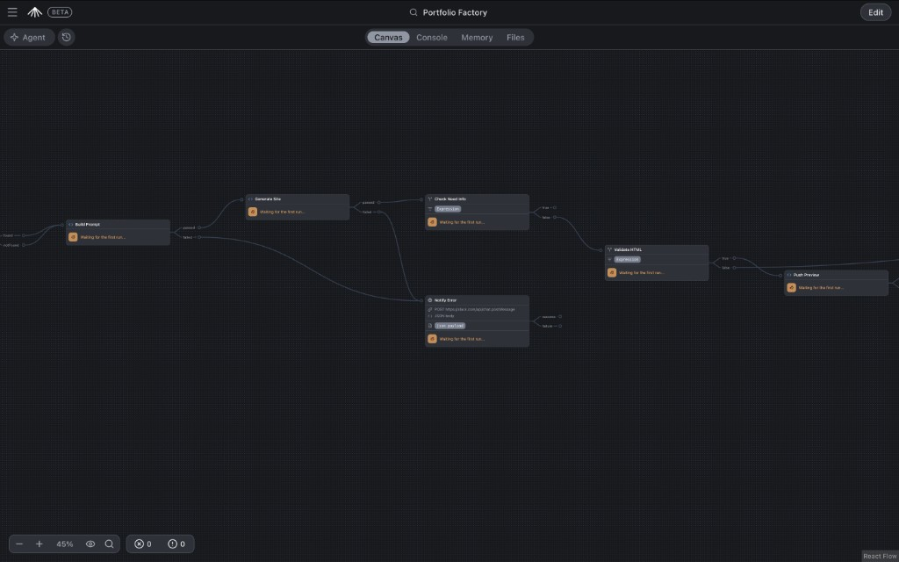
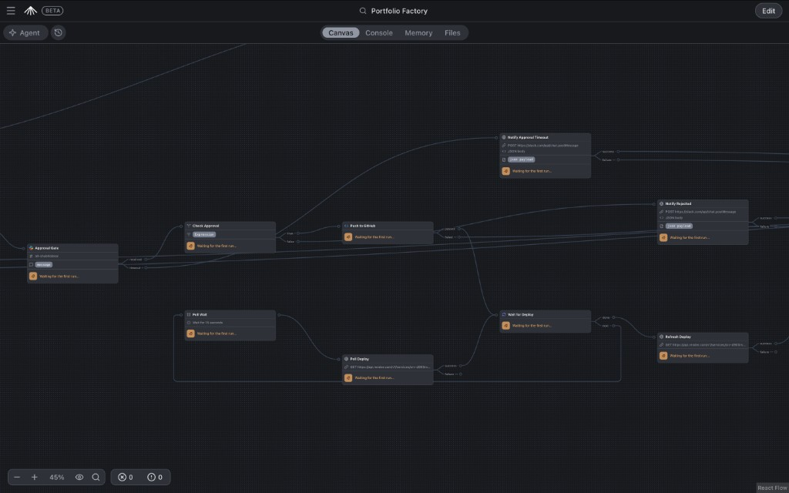
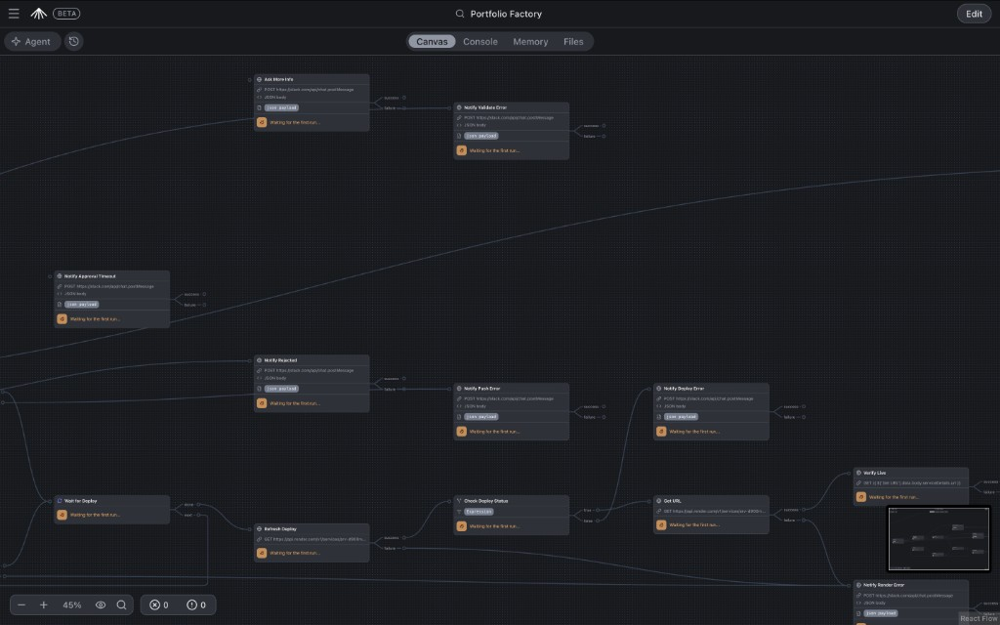
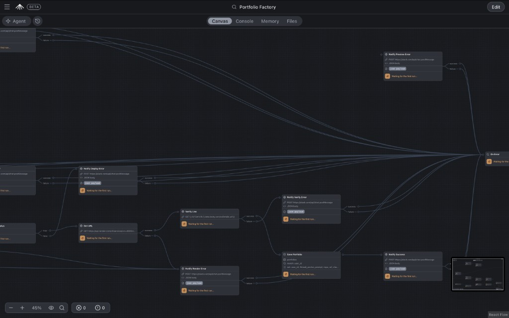
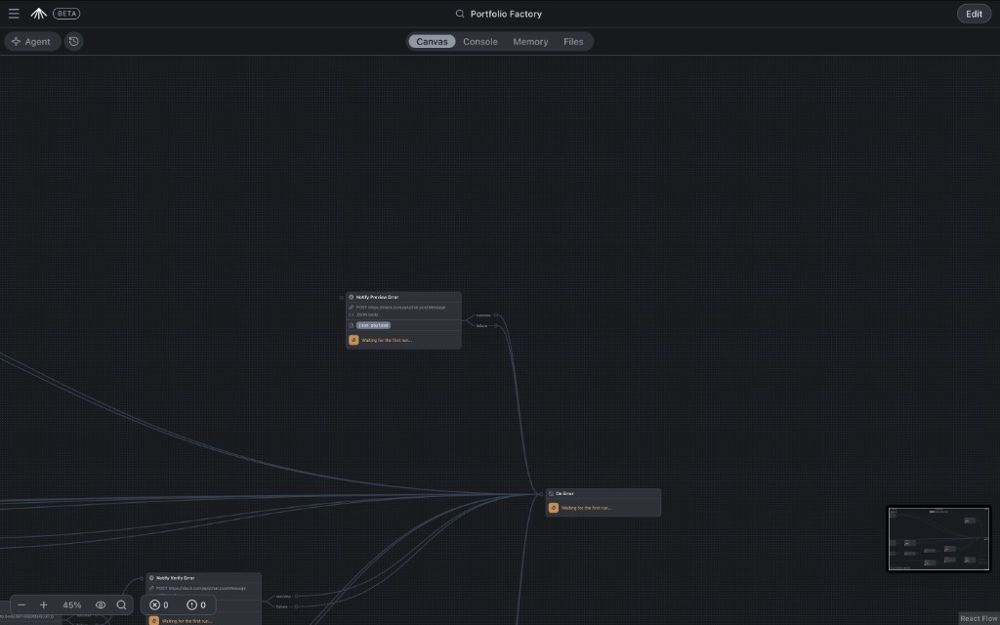

# Portfolio Factory

**Portfolio Factory** is an open-source [SuperPlane](https://superplane.com) automation that turns a Slack conversation into a live personal portfolio website.

Mention a Slack bot with a design brief → GPT-5 generates a self-contained `index.html` via OpenRouter → a GitHub preview branch is published for review → human approval in Slack → push to `main` → Render deploys production → the bot posts the live URL back in the thread.

This repository ships a sanitized, import-ready canvas (`canvas.yaml`) so other developers can recreate the workflow in their own SuperPlane workspace.

## Live demo

Join the public Slack demo workspace:

[Join the Portfolio Factory Slack workspace](https://join.slack.com/t/shubhlabsai/shared_invite/zt-43soggs7m-AyaXY8cG1s01VqwxMtz6zw)

You can also scan the QR code below from your phone:



### How to use the demo

- You can start a request in any Slack channel where the bot is present.
- Every request must include `@SuperPlane`. Messages without the mention will not be processed.
- After the first request, continue inside the same Slack thread so the bot can reuse the full conversation history.
- Use `@SuperPlane` again for every follow-up message in the thread.

Accepted input you can paste into Slack (with the `@SuperPlane` mention):

- LinkedIn profile text or URL
- GitHub profile or repository links
- Resume / CV text
- Project descriptions
- Other copied text (bio, skills, experience, contact details)

**Disclaimer:** The live site is generated only from user-provided content in the Slack thread. The automation does not scrape external profiles on its own—paste or type whatever details you want reflected on the page.

The live demo deploys preview and production HTML to the GitHub account **`intoxic9`**, repository [`intoxic9/Superplane_hackathon`](https://github.com/intoxic9/Superplane_hackathon).

Example:

```text
@SuperPlane Build a modern portfolio website for an AI engineer using the resume below.
```

Then, in the **same thread**, refine with another mention:

```text
@SuperPlane Make the design darker and add a Projects section.
```



---

## Table of contents

- [Live demo](#live-demo)
- [What it does](#what-it-does)
- [Problem it solves](#problem-it-solves)
- [Architecture](#architecture)
- [Workflow walkthrough](#workflow-walkthrough)
- [Repository structure](#repository-structure)
- [Prerequisites](#prerequisites)
- [Required secrets](#required-secrets)
- [Setup](#setup)
- [How to run](#how-to-run)
- [Troubleshooting](#troubleshooting)
- [Security](#security)
- [License](#license)

---

## What it does

| Capability | Detail |
|---|---|
| Slack trigger | Starts on `@bot` mention (`slack.onAppMention`) |
| Conversational memory | Per-thread history in SuperPlane memory (`thread_messages`) |
| Site generation | OpenRouter + `openai/gpt-5` → single-file HTML |
| Preview | Force-pushes `preview/<slack_user_id>` and shares an htmlpreview URL |
| Human gate | Slack buttons: **Approve & Deploy** / **Reject** (10‑minute timeout) |
| Production | Pushes approved `index.html` to the repo default branch |
| Hosting | Polls Render deploys until `live`, verifies HTTP 200 |
| Catalog | Saves deploy metadata in `portfolios` memory namespace |

---

## Problem it solves

Shipping a portfolio usually means writing HTML/CSS by hand, iterating on design feedback across tools, wiring Git, and waiting on hosting. Portfolio Factory compresses that into one Slack thread:

1. Describe (or refine) what you want.
2. Review a browser preview.
3. Click approve to go live.

Refinements like “make it darker” or “add a Speaking section” stay in-thread; the canvas reloads prior messages so GPT-5 sees the full conversation.

---

## Architecture

See also [architecture.md](./architecture.md) for a Mermaid flowchart with every error branch.

```text
Slack mention
  → Ack Start
  → Clean Prompt
  → Save Thread Message
  → Load Thread Context
  → Build Prompt
  → Generate Site (OpenRouter / GPT-5)
  → Validate HTML
  → Push Preview (GitHub)
  → Approval Gate (Slack)
  → Push to GitHub (main)
  → Wait for Deploy (Render poll loop)
  → Verify Live
  → Save Portfolio
  → Notify Success
```

Error paths (insufficient info, validation, GitHub, rejection, timeout, Render, verify) notify Slack and terminate at a shared **On Error** noop.

### Integrations

| System | Role |
|---|---|
| **SuperPlane** | Canvas orchestration, secrets, memory, Slack component nodes |
| **Slack** | Trigger, acks, approval buttons, all user-facing notifications |
| **OpenRouter** | Chat completions (`openai/gpt-5`) for HTML generation |
| **GitHub** | Preview branches + production `index.html` |
| **Render** | Hosting; deploy status API + live URL |

---

## Workflow walkthrough

### 1. Full canvas

The published SuperPlane graph end-to-end: trigger on the left, generation and gates in the middle, Render verification and notifications on the right, with many failure edges converging on **On Error**.


### 2. Slack intake and thread memory



1. **On Mention** — Slack app mention triggers the canvas.
2. **Ack Start** — `POST https://slack.com/api/chat.postMessage` acknowledges in-thread.
3. **Clean Prompt** — Strips Slack mention markup, normalizes links, optional `repo:owner/name` override.
4. **Save Thread Message** — Upserts into namespace `thread_messages` (`thread_anchor`, `ts`, `user_id`, `prompt`).
5. **Load Thread Context** — Reads prior messages for the same thread (`found` / `notFound`).

### 3. Prompt build, GPT-5 generation, validation, preview



1. **Build Prompt** — Formats thread history (oldest first) + latest message into one LLM brief.
2. **Generate Site** — Calls OpenRouter with model `openai/gpt-5`; returns HTML or `NEED_MORE_INFO: …`.
3. **Check Need Info** — If the model asked for more detail, route to Slack (see step 5).
4. **Validate HTML** — Requires content that starts with `<` and is long enough to be a real page.
5. **Push Preview** — Writes `index.html` to `preview/<user_id>` and returns an htmlpreview URL.
6. Failures from build / generate / early checks hit **Notify Error** (Slack).

### 4. Human approval, production push, Render wait loop



1. **Approval Gate** — Slack buttons: Approve & Deploy / Reject; 600s timeout.
2. **Check Approval** — `approve` → production path; otherwise reject notification.
3. **Push to GitHub** — Commits approved HTML to the default branch.
4. **Wait for Deploy** — Loop: wait 15s → poll Render `…/deploys?limit=1` until `live` / failure / canceled (max 30 iterations, 15 minutes).
5. Timeout and reject paths post Slack messages and exit.

### 5. Clarifying questions and deploy status checks



- **Ask More Info** / **Notify Validate Error** — User-facing feedback when the brief is thin or HTML is invalid.
- **Notify Approval Timeout** / **Notify Rejected** — Human-gate outcomes; preview link retained on timeout.
- **Refresh Deploy** → **Check Deploy Status** → **Get URL** → **Verify Live** — Confirm Render `live` and HTTP 200 on the service URL.

### 6. Persist metadata and notify success



1. **Get URL** — `GET` Render service details.
2. **Verify Live** — `GET` the public site URL; expect `200`.
3. **Save Portfolio** — Upsert namespace `portfolios` (`user_id`, `thread_anchor`, `prompt`, `repo`, `url`, …).
4. **Notify Success** — Posts the live URL (and repo) back to the Slack thread.

Failing Get URL / Verify Live / deploy status routes send **Notify Deploy Error**, **Notify Render Error**, or **Notify Verify Error**.

### 7. Shared error sink



Almost every notification path (preview failure, pipeline error, deploy failure, success) ends at **On Error**, a noop that gives the run a single terminal node.

---

## Repository structure

```text
.
├── LICENSE                 # MIT
├── README.md               # This file
├── architecture.md         # Mermaid flowchart + error branch map
├── canvas.yaml             # Public SuperPlane canvas (import this)
├── console.yaml            # Companion console stub (empty panels)
├── canvas.private.yaml     # Local working copy (gitignored)
├── .env.example            # Secret name placeholders
├── .gitignore
├── docs/                   # Extra notes
├── examples/
│   └── sample-slack-prompt.md
└── screenshots/
    ├── 01-full-canvas.png
    ├── 02-slack-intake-memory.png
    ├── 03-generate-validate-preview.png
    ├── 04-approval-github-render.png
    ├── 05-validation-deploy-checks.png
    ├── 06-verify-save-success.png
    └── 07-error-sink.png
```

`canvas.yaml` preserves the full workflow (nodes, edges, scripts, prompts, memory). Operational IDs are placeholders you must replace after import.

---

## Prerequisites

- SuperPlane workspace with canvas import + secrets
- Slack workspace where you can install / connect a Slack app
- GitHub repository for `index.html` (preview + production branches)
- Render static site or web service wired to that repository’s production branch
- OpenRouter account with access to `openai/gpt-5` (or change the `MODEL` literal on **Generate Site**)

---

## Required secrets

Configure these **names** in SuperPlane Secrets (values never belong in git):

| Secret | Purpose |
|---|---|
| `OPENROUTER_API_KEY` | Bearer token for OpenRouter chat completions |
| `GH_TOKEN` | Clone/push preview + production branches |
| `SLACK_BOT_TOKEN` | `chat.postMessage` acks and notifications |
| `RENDER_API_KEY` | Render service + deploy API |

`.env.example` lists the same keys for documentation only.

### Placeholders to replace in `canvas.yaml`

| Placeholder | Meaning |
|---|---|
| `YOUR_CANVAS_ID` | Canvas ID (or let import assign one) |
| `YOUR_GITHUB_USERNAME/YOUR_REPOSITORY` | Default GitHub repo for Push Preview / Push to GitHub |
| `YOUR_SLACK_CHANNEL_ID` | Channel for Approval Gate buttons |
| `YOUR_SLACK_CHANNEL_NAME` | Channel display name (metadata) |
| `YOUR_RENDER_SERVICE_ID` | Render service id (`srv-…`) |
| `YOUR_SUPERPLANE_INTEGRATION_ID` | Slack integration id on On Mention / Approval Gate |
| `YOUR_APP_SUBSCRIPTION_ID` | Slack app subscription on On Mention |

---

## Setup

### 1. Clone this repository

```bash
git clone https://github.com/YOUR_GITHUB_USERNAME/YOUR_REPOSITORY.git
cd YOUR_REPOSITORY
```

### 2. Import the canvas into SuperPlane

1. Open your SuperPlane workspace.
2. Create or open a canvas.
3. Import / upload `canvas.yaml` (and optionally `console.yaml`).
4. Rebind Slack:
   - **On Mention** → your app subscription + integration IDs
   - **Approval Gate** → your channel ID + integration ID
5. Attach secrets: `OPENROUTER_API_KEY`, `GH_TOKEN`, `SLACK_BOT_TOKEN`, `RENDER_API_KEY`.
6. Replace GitHub default repo and Render service ID placeholders everywhere they appear (including Slack error message dashboard URLs).
7. Save and enable the canvas / trigger.

Exact menu labels may vary by SuperPlane UI version; the imported graph already contains scripts and edges.

### 3. Configure Slack

1. Connect Slack in SuperPlane Integrations.
2. Invite the bot to the approval channel.
3. Ensure the bot can post messages and interactive buttons.
4. Set Approval Gate `channel` to your channel ID.

### 4. Configure GitHub

1. Create or reuse a repository for portfolio HTML.
2. Issue a token with contents read/write on that repo.
3. Store it as `GH_TOKEN`.
4. Set `DEFAULT_REPO` on **Push Preview** and **Push to GitHub**.
5. Optional per-request override: include `repo:owner/name` in the Slack message.

### 5. Configure OpenRouter

1. Create an API key at [openrouter.ai](https://openrouter.ai).
2. Store as `OPENROUTER_API_KEY`.
3. Confirm `openai/gpt-5` is available, or change **Generate Site** → `MODEL`.

### 6. Configure Render

1. Create a static site (or web service) that deploys from your GitHub production branch.
2. Copy the service ID (`srv-…`).
3. Create a Render API key → `RENDER_API_KEY`.
4. Replace `YOUR_RENDER_SERVICE_ID` on **Get URL**, **Poll Deploy**, **Refresh Deploy**, and related Slack texts.

---

## How to run

1. Enable the canvas in SuperPlane.
2. In the configured Slack channel, mention the bot with a brief. Example:

   ```text
   @PortfolioFactory Build a software engineer portfolio for Jordan Lee…
   ```

   Full sample: [examples/sample-slack-prompt.md](./examples/sample-slack-prompt.md).

3. Wait for the ack, then the approval message with a preview link.
4. Open the preview → click **Approve & Deploy** or **Reject**.
5. On approve, wait for the success message with the live Render URL.
6. To iterate, reply **in the same thread** (e.g. `@bot use a darker palette`). Memory keeps prior context.

---

## Troubleshooting

| Symptom | Likely cause | What to check |
|---|---|---|
| Canvas never starts | Trigger not bound / bot not in channel | On Mention subscription + integration IDs; invite bot; ensure you `@mention` the app |
| No ack in Slack | `SLACK_BOT_TOKEN` missing or invalid | Secret name exact match; bot scopes for `chat:write` |
| Generation fails | OpenRouter key / model | `OPENROUTER_API_KEY`; model string `openai/gpt-5`; OpenRouter dashboard usage |
| `NEED_MORE_INFO` reply | Brief too vague | Include at least a name + role/vibe; see sample prompt |
| Validate / “didn’t look like valid HTML” | Model returned prose or truncated HTML | Refine brief in-thread; retry; inspect Generate Site result in SuperPlane run |
| Preview / push errors | GitHub auth or repo path | `GH_TOKEN` permissions; `DEFAULT_REPO`; clone URL in run logs (tokens scrubbed) |
| Approval never appears | Wrong channel ID / integration | Approval Gate `YOUR_SLACK_CHANNEL_ID` + integration ID |
| Approval timeout | No click within 10 minutes | Re-mention in thread; preview URL still in timeout message |
| Render poll never goes live | Repo not connected or service ID wrong | Render auto-deploy from `main`; `YOUR_RENDER_SERVICE_ID`; `RENDER_API_KEY` |
| Deploy error status | Build failed on Render | Render dashboard logs; valid `index.html` on production branch |
| Verify Live fails | DNS / CDN lag or wrong URL | Wait and open URL manually; check Get URL `serviceDetails.url` |
| Refinements ignore prior context | New thread / wrong anchor | Reply in the **same** Slack thread so `thread_anchor` matches |

Use SuperPlane’s run inspector (Console / canvas run details) for node-level outputs. Notification nodes post the failure stage and message when GitHub/Render return structured errors.

---

## Security

- Keep `canvas.private.yaml` private (listed in `.gitignore`).
- Commit secret **names** only—never values, PEM/key files, or `.env`.
- Prefer least-privilege tokens (single-repo GitHub; scoped Slack/Render).
- Scripts scrub `x-access-token:…@` from GitHub error text before writing results.
- Production push only after Slack **Approve**.
- Treat `preview/*` branches as disposable review artifacts.

---

## Future improvements

- Stronger HTML/a11y checks before preview
- Design-kit / brand injection
- Per-user Render preview services
- Thread summarization for long conversations
- Slash command or modal for structured briefs

---

## License

MIT — see [LICENSE](./LICENSE).
