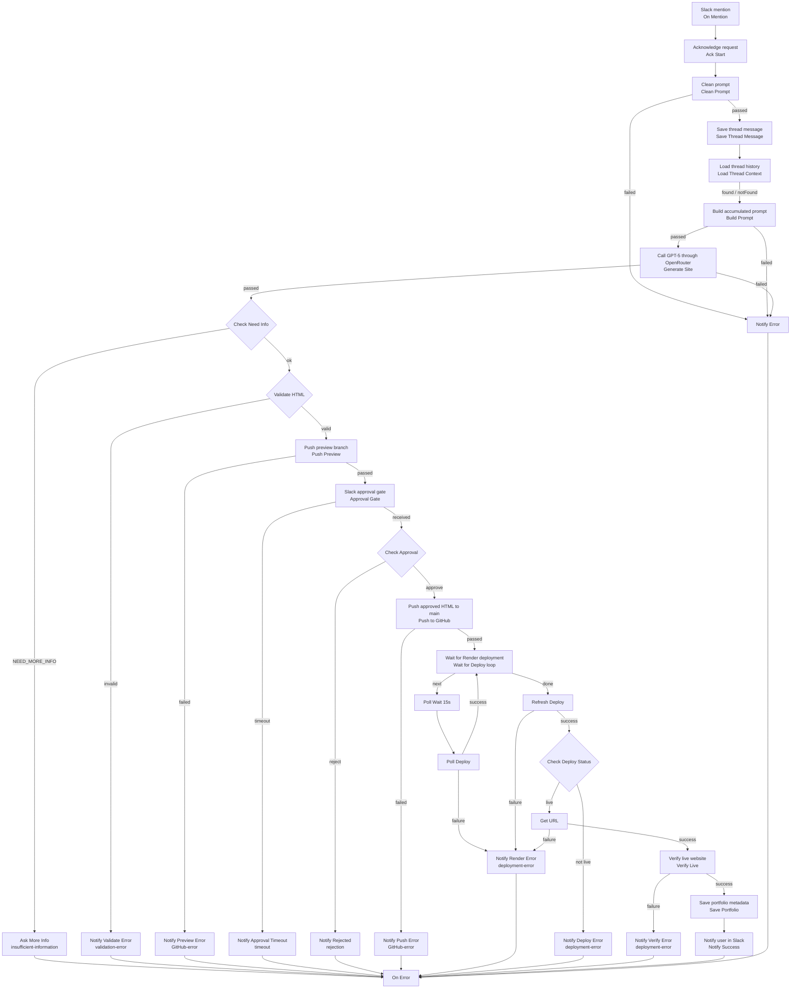

# Portfolio Factory Architecture

Flow of the SuperPlane canvas in `canvas.yaml`, including success path and error branches.

## Node map (happy path)

| Step | Canvas node |
|---|---|
| Trigger | On Mention |
| Ack | Ack Start |
| Normalize Slack text | Clean Prompt |
| Memory write | Save Thread Message |
| Memory read | Load Thread Context |
| Context → brief | Build Prompt |
| LLM | Generate Site |
| Info gate | Check Need Info |
| HTML gate | Validate HTML |
| Preview | Push Preview |
| Human gate | Approval Gate → Check Approval |
| Production | Push to GitHub |
| Deploy wait | Wait for Deploy → Poll Wait → Poll Deploy → Refresh Deploy |
| Status gate | Check Deploy Status |
| Live URL | Get URL → Verify Live |
| Persist | Save Portfolio |
| Done | Notify Success |

## Error branches

| Branch | Trigger | Node(s) |
|---|---|---|
| insufficient-information | Model returns `NEED_MORE_INFO…` | Ask More Info |
| validation-error | HTML check fails | Notify Validate Error |
| GitHub-error | Preview or production push fails | Notify Preview Error / Notify Push Error |
| rejection | User clicks Reject | Notify Rejected |
| timeout | Approval Gate times out (10 min) | Notify Approval Timeout |
| deployment-error | Render API failure, non-live status, or verify ≠ 200 | Notify Render Error / Notify Deploy Error / Notify Verify Error |
| generic | Clean / Build / Generate failures | Notify Error |

All notification paths terminate at the **On Error** noop node so the run ends in a defined state.
